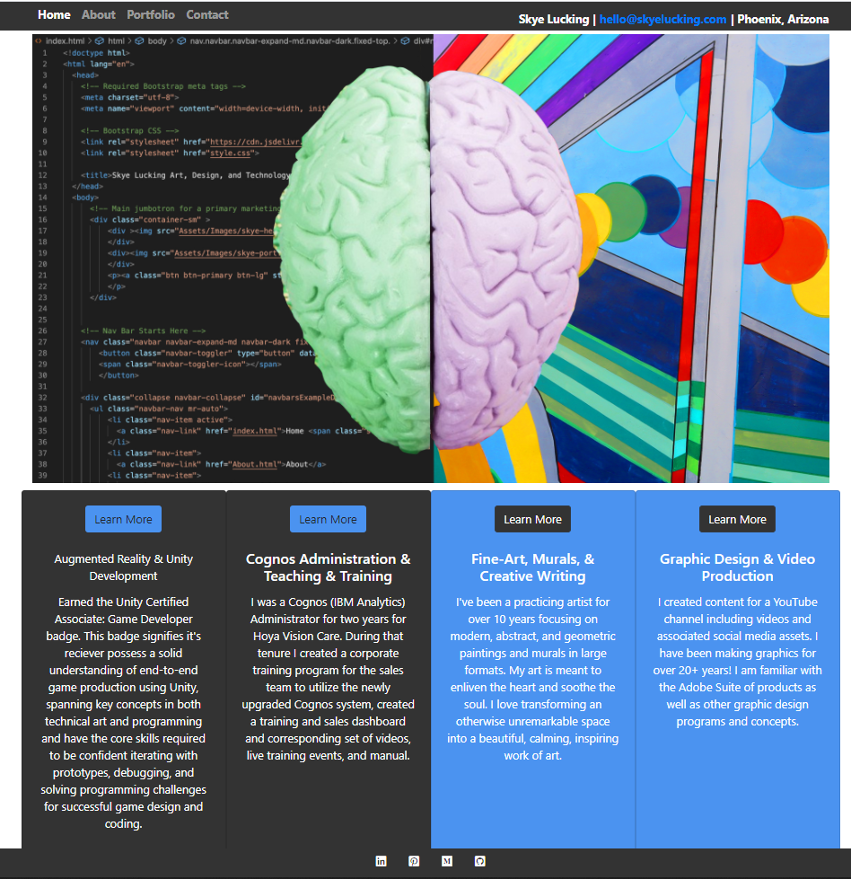
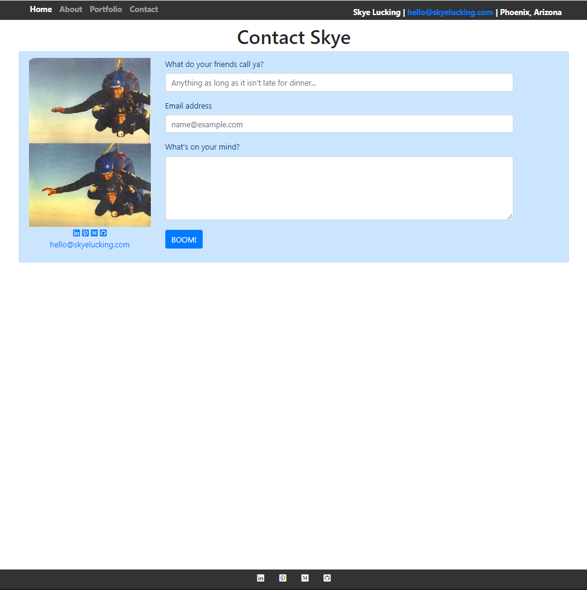
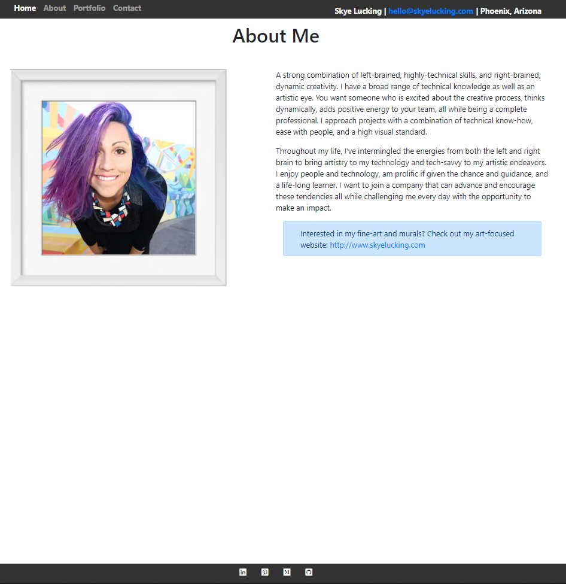
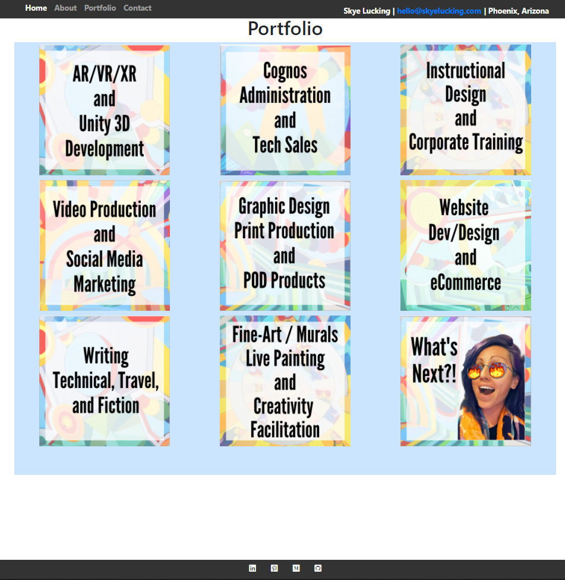

# Skye Lucking - Unit 02 CSS and Bootstrap Homework: Responsive Portfolio

<h1>Description of application</h1>
This is portfolio website for Skye Lucking. While it's the homework assignment for the "Unit 02 CSS and Bootstrap Homework: Responsive Portfolio" the ultimate goal is to transfer this to the permanent/official technology portfolio for Skye Lucking. 

<h1>Screenshot</h1>
 
 
 
 

<h1>Link to the deployed application</h1>
<a href="https://skyelucking.github.io/02-responsive-portfolio/index.html">https://skyelucking.github.io/02-responsive-portfolio/index.html</a>

<h1>Link to GitHub Repo</h1>
<a href="https://github.com/skyelucking/02-responsive-portfolio">https://github.com/skyelucking/02-responsive-portfolio</a>

Now here is your joke... 
What does the world's top dentist get? 
 
 
 
<em>A little plaque.</em>

